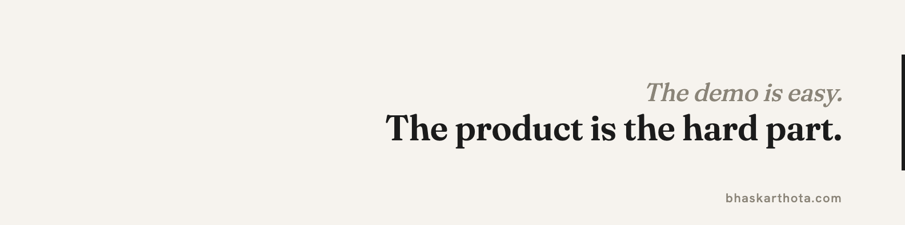
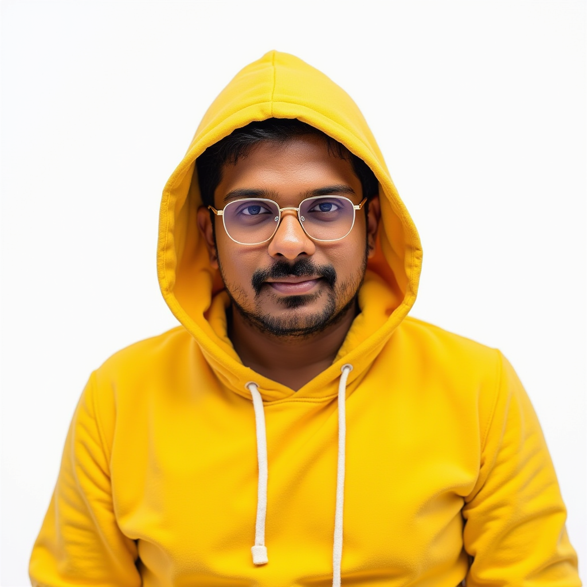
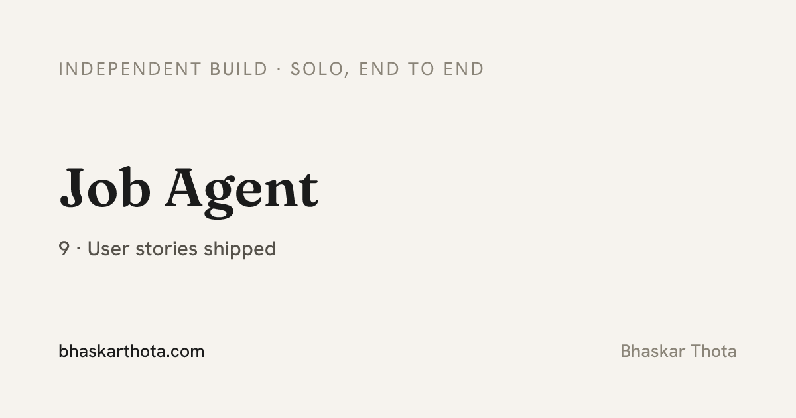
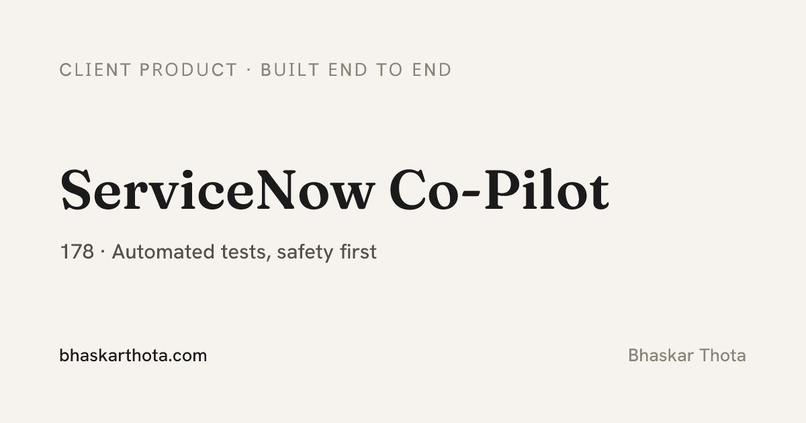
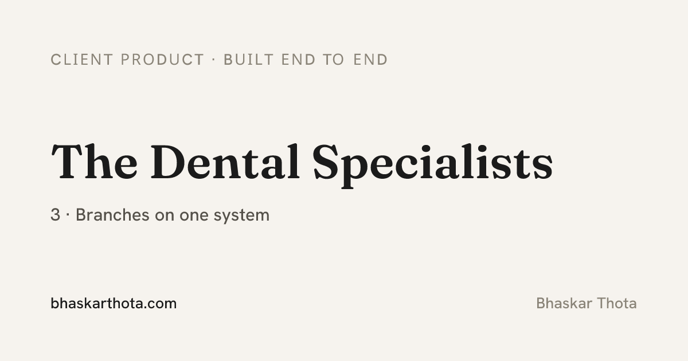
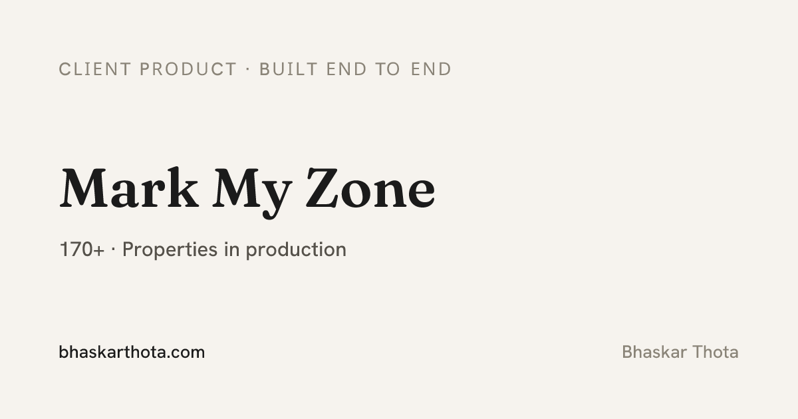

<table>
<tr>
<td width="28%" valign="top">

</td>
<td width="72%" valign="top">

# Bala Bhaskar Sai Thota

**AI Product Manager who specs the product, then builds it.**

Around 6 years building digital products for startups and small businesses. The
last 3.5 on AI. I run the full loop, from discovery and requirements through
prioritization, shipping, and feedback, and I prototype with AI tools so the specs
are real and the roadmap matches what can actually ship.

</td>
</tr>
</table>

This profile is a map. The work lives at **[bhaskarthota.com](https://bhaskarthota.com)**.

## Selected work
<table>
<tr>
<td width="50%" valign="top">

<b>Job Agent.</b> A multi user AI job hunt assistant I designed and built end to end. 
<a href="https://bhaskarthota.com/work/job-agent">Case study</a> &middot; <a href="https://job-agent-rust.vercel.app">Live</a>
</td>
<td width="50%" valign="top">

<b>ServiceNow Copilot.</b> An enterprise assistant grounded in real workflows. 
<a href="https://bhaskarthota.com/work/servicenow-copilot">Case study</a>
</td>
</tr>
<tr>
<td width="50%" valign="top">

<b>Dental Records PWA.</b> A multi branch clinical records app with a grounded RAG copilot. 
<a href="https://bhaskarthota.com/work/the-dental-specialists">Case study</a>
</td>
<td width="50%" valign="top">

<b>Mark My Zone.</b> A property dashboard that cut operational time in half. 
<a href="https://bhaskarthota.com/work/mark-my-zone">Case study</a>
</td>
</tr>
</table>

## How I work
Discovery to spec to prototype to ship. I would rather build a rough version and
learn from it than argue about it in a doc. AI is a teammate in that loop, not a
buzzword on the roadmap.

## Tools I build with
Next.js &middot; Supabase &middot; LangGraph &middot; RAG pipelines &middot; Claude and GPT &middot; Python &middot; Vercel

## Resume
[Product Manager (PDF)](https://bhaskarthota.com/resumes/Bhaskar_Thota_Resume_Product_Manager.pdf)

## Find me
[bhaskarthota.com](https://bhaskarthota.com) &middot; [LinkedIn](https://linkedin.com/in/bhaskar657) &middot; hello@bhaskarthota.com

<!-- profile -->

<!-- profile refresh 2026-06-22: re-trigger README surfacing after username rename -->
